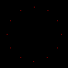

# Raytracer Challenge
Raytracer development working through the book [The Ray Tracer Challenge](https://www.amazon.co.uk/Ray-Tracer-Challenge-Jamis-Buck/dp/1680502719/ref=sr_1_1?crid=VTW2K8UE11OA&keywords=ray+tracer+challenge&qid=1577102545&sprefix=ray+tr%2Caps%2C290&sr=8-1)

 


----

# Todo 
- [ ] Implement scene management
- [ ] kd-tree Bounding boxes
- [ ] Procedurally generate some shapes
- [ ] Refactor shape and intersection files
- [ ] Improve gradient to transition smoothly after x=1
- [ ] Nested patterns - Patterns should be provided other patterns. Only solid color pattern takes a color.
- [ ] Refactor color to be simple struct ?
- [ ] resolution as commandline params
- [ ] Implement cones
- [ ] Improve float_equals to handle zero ?
- [ ] Rewrite gethit using lower_bound ?
- [ ] Add doxygen comments
- [ ] Refactor cmake and folders to be cleaner ?
- [ ] Implment other point/vector functions/tests. Try and tidy up operators again (VECTOR-VECTOR) ?
- [ ] Rework using slices....
- [ ] Canvas as a template
- [ ] Provide pattern copy template to refactor away clone member function
- [ ] Refactor tuples/vectors/points. 

----
# Build info
The project uses cmake
Basic build would look like
```
mkdir build
cd build
cmake <path to source>
make
```

If you have downloaded gtest then you can point cmake at it so that you do not need to redownloade/build it using
```
mkdir build
cd build
cmake -DGTEST_ROOT=<path to gtest install> <path to source>
make 
```
# Implementation notes.


Currently the lighting calculation is a stand alone function in the light module.
Perhaps will need to be turned into class or similar?


## Optimisations

So now that we have triangles we can handle more arbitraty shapes, but these are also more complex using many triangles which can really hit performance.
Next step it likely to do some optimisations of the algorithm to improve this.
Most common seems to be k-d tree bounding box.
Basic concept is that we have a binary tree of bounding boxes, which can be searched.
To traverse the tree we recurse into it by calling a hit function for that node. This will check if the bounding box has been hit, if not then that search path is terminated.
If it is hit then it checks the left and right paths and returns the closest of these.
Primatives (triangles etc), are terminal nodes. 

The trick to this working well is how the tree is constructed. Figuring out the optimum method is an area of ongoing research. One relatively simply technique is to pick an axis in a round robin fashion and create the split at the median position along that axis. 

----
## Latest output


----
## Performance (rendering latest image)

Implementing caching of inverse provided ~*6 performance improvement
### Multi Threaded (using OpenMP parallel for)
```

real    0m3.900s
user    0m30.559s
sys     0m0.020s
```
