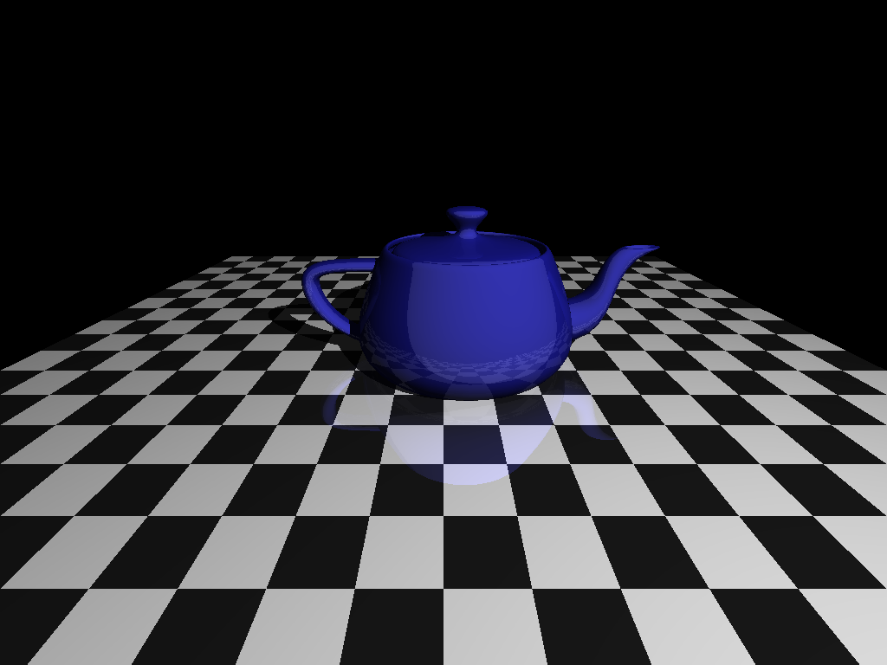

# Raytracer Challenge
Raytracer development working through the book [The Ray Tracer Challenge](https://www.amazon.co.uk/Ray-Tracer-Challenge-Jamis-Buck/dp/1680502719/ref=sr_1_1?crid=VTW2K8UE11OA&keywords=ray+tracer+challenge&qid=1577102545&sprefix=ray+tr%2Caps%2C290&sr=8-1)

 

----

# Todo 
- [ ] Add doxygen comments
- [ ] Improve float_equals to handle zero
- [ ] Implment other point/vector functions/tests. Try ad tidy up operators
- [ ] Rework using slices....
- [x] Move Vector and Point to inherted classes with raytuple as the base class
- [x] Implement transforms and identits as class members to allow chaining!
- [x] Implement time based filename generator
- [x] Tidy up test names
- [x] Update to use namespace for matrix as well

----
# Implementation notes.
Should the intersection routine be part of the object that is being intersected, or part of the ray?
If it is part of the ray we have to add to the ray class each time we implement a new object type.
However the returned intersections are relative to a specific ray, so from that point there is sense in it being part of the ray object?

In general I think the best approach is for it to be part of the object being intersected.
We should also allow plan for the rays to interact with a variety of objects so worth considering a hierarcy now.

e.g. spheres, cubes etc are derived from generic objects.
All objects will implement the intersects function
and will have
- Material
- Position, may be different for different classes e.g. center + size for spheres, array of 3 points for triangles

----
## Latest output

